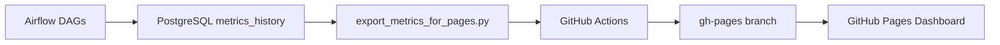

# Spam Model Monitoring (Airflow + MLflow + Grafana + GitHub Actions)

An end-to-end MLOps project for **daily monitoring of a spam detection model**.
Automatically orchestrated, visualized, and published — entirely in the cloud.

---

## Architecture

- **Airflow** – orchestrates daily evaluation runs and stores metrics in PostgreSQL 
- **MLflow** – manages models and threshold artifacts
- **Grafana** – visualizes historical trends and drifts 
- **GitHub Actions** – exports daily metrics from the VM 
- **GitHub Pages** – hosts the live performance preview (JSON + chart)

---

## Workflow

Every night at **03:05 UTC**:
1. Airflow writes the latest model metrics to Postgres 
2. `export_metrics_for_pages.py` exports them as JSON
3. GitHub Actions fetches the file from the VM 
4. The `metrics.json` is automatically deployed → [Live Dashboard](https://thiev980.github.io/mlops-spam-gcp/)

---

## Live Monitoring

**[View the latest deployment](https://thiev980.github.io/mlops-spam-gcp/)**  
*(auto-updated daily via CI/CD)*

---

## Stack

| Category | Tool / Framework |
|------------|------------------|
| Orchestration | Apache Airflow |
| Tracking | MLflow |
| Monitoring | Grafana |
| Database | PostgreSQL |
| Automation | GitHub Actions |
| Hosting | GitHub Pages |

---

## Contact

👤 **Thierry Figini**  
🔗 [GitHub-Profil](https://github.com/thiev980) • [LinkedIn](https://www.linkedin.com/in/thierryfigini/)  
✉️ thierry_figini@me.com
