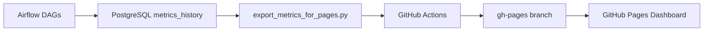

# Spam Model Monitoring & Live Inference  
**Airflow + MLflow + Postgres + Grafana + FastAPI + Cloudflare + GitHub Actions/Pages**

End-to-end MLOps für ein Spam-Detection-System: **tägliche Batch-Evaluation**, **Model-Registry**, **Dashboards** – plus **Live-Inference** via FastAPI, sicher veröffentlicht über **Cloudflare Tunnel** und auf **GitHub Pages** eingebunden.

---

## Überblick

- **Airflow** orchestriert tägliche Jobs (ETL, Evaluation, Export).
- **MLflow** loggt Runs & Modelle; (optional) Promotion-Policy via Registry.
- **PostgreSQL** speichert Metriken & Zeitreihen.
- **Grafana** visualisiert Trends/Drift aus Postgres.
- **GitHub Actions** holt täglich *metrics.json* von der VM und deployt auf **GitHub Pages**.
- **FastAPI** servt das aktuelle Modell als HTTP-API (`/predict`).
- **Cloudflare Tunnel** publiziert die API sicher als **HTTPS-Subdomain**.
- **Docker Compose** betreibt alles reproduzierbar auf der GCP-VM.

---

## Architecture

- **Airflow** – orchestrates daily evaluation runs and stores metrics in PostgreSQL 
- **MLflow** – manages models and threshold artifacts
- **Grafana** – visualizes historical trends and drifts 
- **GitHub Actions** – exports daily metrics from the VM 
- **GitHub Pages** – hosts the live performance preview (JSON + chart)

---

## Workflow

Every night at **03:05 UTC**:
1. Airflow writes the latest model metrics to Postgres 
2. `export_metrics_for_pages.py` exports them as JSON
3. GitHub Actions fetches the file from the VM 
4. The `metrics.json` is automatically deployed → [Live Dashboard](https://thiev980.github.io/mlops-spam-gcp/)

---

## Live Monitoring

**[View the latest deployment](https://thiev980.github.io/mlops-spam-gcp/)**  
*(auto-updated daily via CI/CD)*

---

## Stack

| Category | Tool / Framework |
|------------|------------------|
| Orchestration | Apache Airflow |
| Tracking | MLflow |
| Monitoring | Grafana |
| Database | PostgreSQL |
| Automation | GitHub Actions |
| Hosting | GitHub Pages |

---

## Contact

👤 **Thierry Figini**  
🔗 [GitHub-Profil](https://github.com/thiev980) • [LinkedIn](https://www.linkedin.com/in/thierryfigini/)  
✉️ thierry_figini@me.com
